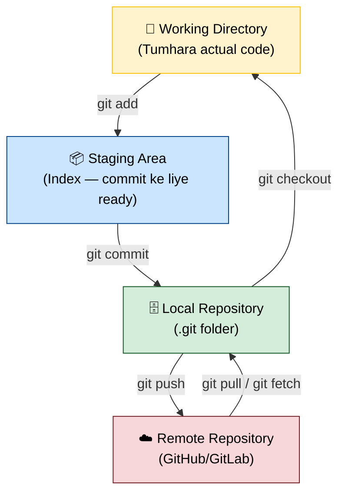
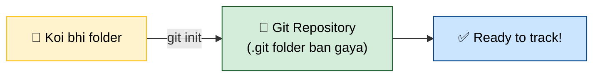
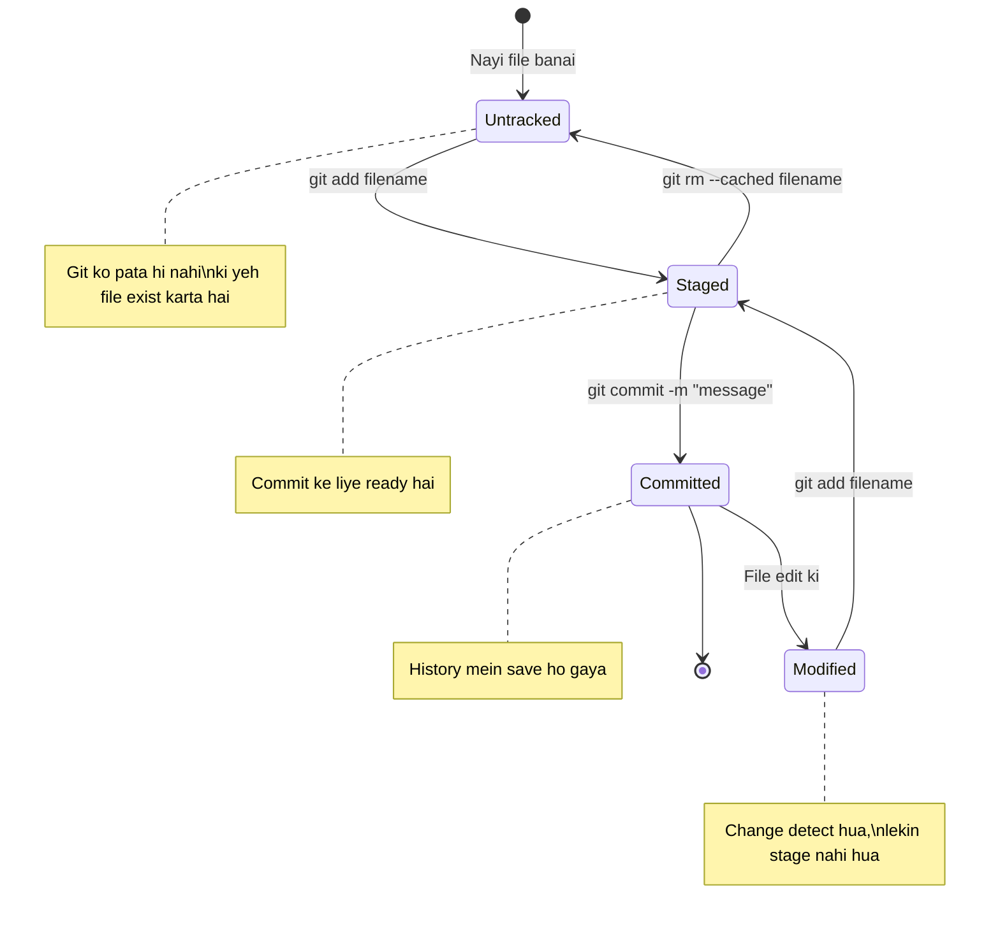
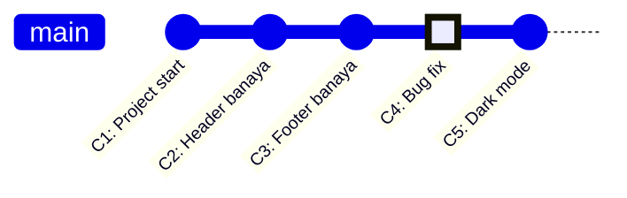
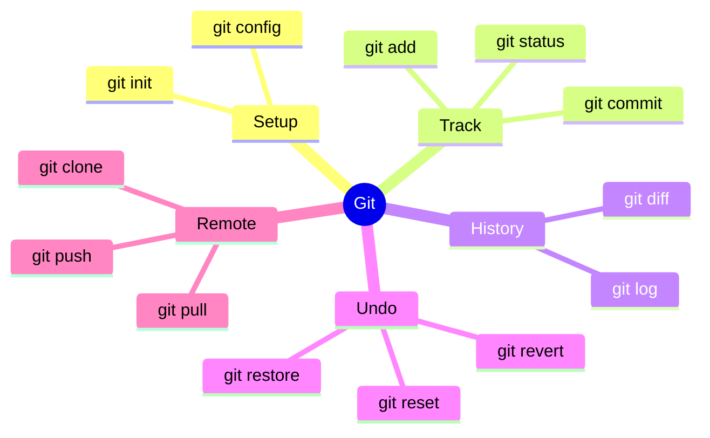

# 🚀 Part 1: Git Basics — Shuru se Seekho!

> **Yeh tutorial Hinglish mein hai** — toh bilkul tension mat lo, sab clearly samjhega!

---

## 🤔 Git Kya Hai?

**Git** ek **Version Control System (VCS)** hai. Simple words mein — yeh tumhare code ka **time machine** hai!

Sochlo tumne ek project banaya, kuch changes kiye, aur galat ho gaya. Git se tum **purana version wapas la sakte ho** ek command se!

```
Bina Git ke:  project_v1.zip, project_v2.zip, project_FINAL.zip, project_FINAL_FINAL.zip 😭
Git ke saath:  bas ek folder, aur poora history save! 😎
```

---

## 🏗️ Git Ka Internal Architecture



### Samajhte hain teen zones:

| Zone | Kya Hai? | Example |
|------|----------|---------|
| **Working Directory** | Jahan tum kaam karte ho | Notepad mein type karna |
| **Staging Area** | Commit ke liye line lagana | Draft banate hain |
| **Local Repository** | Tera local database (.git folder) | Saved history |
| **Remote Repository** | GitHub pe online copy | Cloud backup |

---

## ⚙️ Git Install & Setup

### Install karo:
```bash
# Windows
# git-scm.com se download karo aur install karo

# Ubuntu/Debian Linux
sudo apt install git

# Mac
brew install git
```

### Pehli baar setup (yeh ek baar hi karna hai):
```bash
git config --global user.name "Tumhara Naam"
git config --global user.email "tumhara@email.com"
git config --global core.editor "code"   # VS Code default editor

# Check karo ki save hua ki nahi
git config --list
```

---

## 📁 Nayi Repository Banana



```bash
# Nayi repo banana
mkdir mera-project
cd mera-project
git init

# Output aayega:
# Initialized empty Git repository in /mera-project/.git/
```

---

## 📸 Git Lifecycle — File Ki Journey



---

## 🔑 Sabse Important Commands

### 1. Status Check Karo
```bash
git status
# Batata hai ki kaunsi files changed hain, staged hain, ya untracked hain
```

### 2. Files Stage Karo
```bash
git add filename.txt          # Sirf ek file
git add folder/               # Poora folder
git add .                     # Sab kuch current directory mein
git add *.js                  # Sirf .js files
```

### 3. Commit Karo — History Save Karo!
```bash
git commit -m "Kya kiya yeh likho"

# Example:
git commit -m "Login page banaya"
git commit -m "Bug fix: password validation theek ki"
git commit -m "README update kiya"
```

> ⚠️ **Tip:** Commit message mein hamesha **kya kiya** likho, kaise nahi!

### 4. History Dekho
```bash
git log                    # Poora history
git log --oneline          # Short format mein
git log --oneline --graph  # Branches bhi dikhega
```

---

## 🕒 Time Travel — Purane Version pe Jaao



```bash
# Commit history dekho
git log --oneline

# Kisi purane commit pe jaao (sirf dekho, kuch change mat karo)
git checkout abc1234

# Wapas current pe aao
git checkout main

# Kisi file ko purane version pe reset karo
git checkout abc1234 -- filename.txt

# Poori repo ek commit pehle pe le jaao (DANGEROUS!)
git reset --hard abc1234
```

---

## 🗑️ Mistakes Undo Karo

```bash
# Last commit ka message change karo (push se pehle!)
git commit --amend -m "Naya message"

# Stage se file hatao (file delete nahi hoga)
git restore --staged filename.txt

# File ke changes undo karo (last commit ke baad ke changes)
git restore filename.txt

# Last N commits undo karo (changes rakhte hue)
git reset --soft HEAD~1   # Last 1 commit undo, changes staged rahenge
git reset HEAD~1          # Last 1 commit undo, changes unstaged rahenge
```

---

## 🙈 .gitignore — Kya Ignore Karein?

Kuch cheezein kabhi bhi Git mein nahi jaani chahiye:

```bash
# .gitignore file banao project root mein
touch .gitignore
```

```gitignore
# .gitignore ka example

# Node modules (bahut bada folder hota hai)
node_modules/

# Environment variables (passwords yahaan hote hain!)
.env
.env.local

# Build files
dist/
build/
*.min.js

# OS files
.DS_Store       # Mac
Thumbs.db       # Windows

# IDE files
.vscode/
.idea/

# Logs
*.log
logs/
```

---

## 📊 Quick Reference Card



---

## 🎯 Practice Exercise

```bash
# Aaj ka practice:
mkdir git-practice
cd git-practice
git init

echo "Hello Git!" > hello.txt
git status                          # Untracked dikhega
git add hello.txt
git status                          # Staged dikhega
git commit -m "Pehla commit!"

echo "Line 2 add ki" >> hello.txt
git diff                            # Changes dekho
git add .
git commit -m "hello.txt update kiya"

git log --oneline                   # History dekho
```

---

## ✅ Part 1 Complete!

Ab tumhe pata hai:
- Git kya hai aur kyun use karte hain
- Working Directory → Staging → Commit ka flow
- Basic commands: `init`, `add`, `commit`, `status`, `log`
- Mistakes kaise undo karein
- `.gitignore` ka use

👉 **Next: [Part 2 — Git Branching & Merging](./Part-2-Branching-and-Merging.md)**