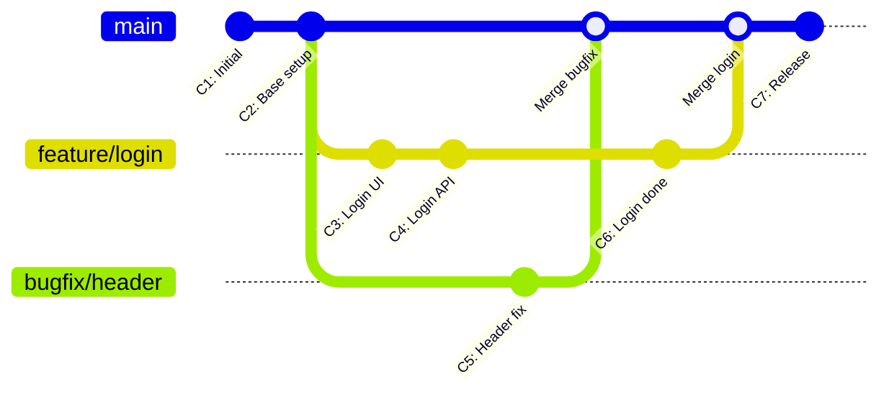
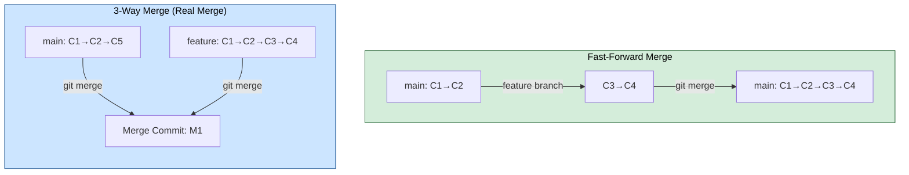
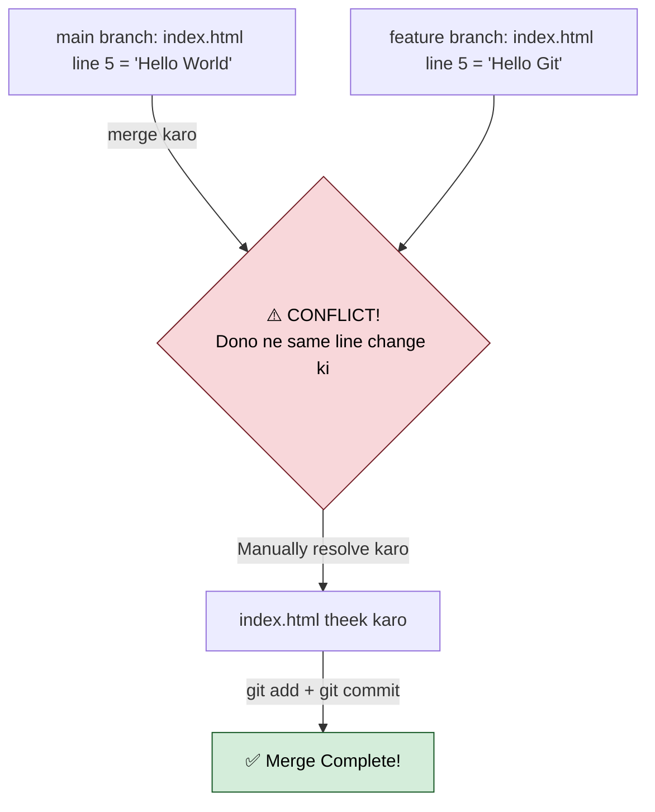
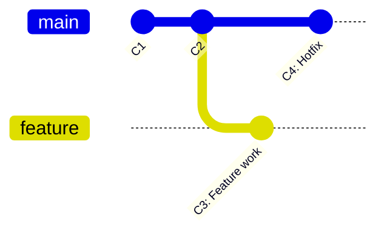
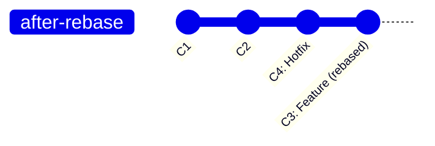
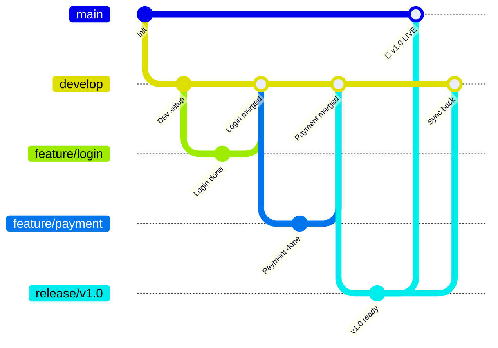
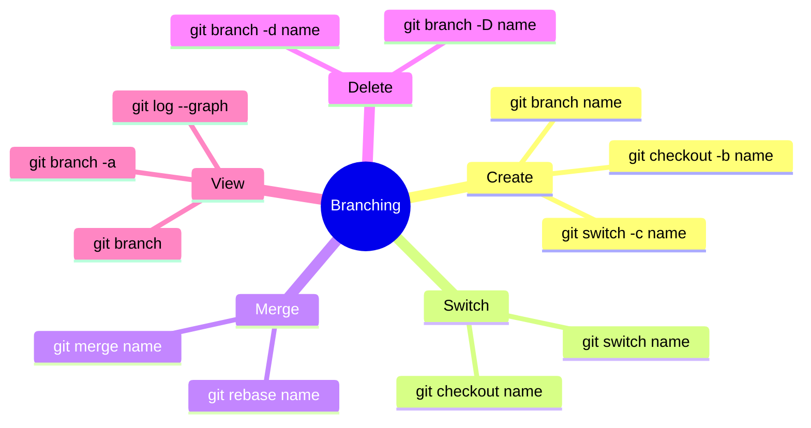

# 🌿 Part 2: Git Branching & Merging — Parallel Duniya Banao!

> **Branches Git ki superpower hain** — alag-alag features ek saath, bina kisi ke kaam mein interference ke!

---

## 🤔 Branch Kyun Chahiye?

Sochlo tum ek team mein ho:
- Anil ➜ Login feature bana raha hai
- Priya ➜ Payment page bana rahi hai
- Rohan ➜ Bug fix kar raha hai

**Bina branch ke** — teeno ka code ek jagah merge hoga = **chaos!** 😱  
**Branch ke saath** — teeno alag-alag kaam karenge, baad mein safely merge! 😎

---

## 🌳 Branch Ka Visual



---

## 🌱 Branch Commands — Poora Arsenal

### Branch Banana
```bash
# Nayi branch banana
git branch feature-login

# Branch banana AUR uspe switch karna (shortcut!)
git checkout -b feature-login

# Modern tarika (Git 2.23+)
git switch -c feature-login
```

### Branch Switch Karna
```bash
# Old tarika
git checkout main

# New tarika (recommended)
git switch main
```

### Branch Dekhna
```bash
git branch            # Local branches
git branch -r         # Remote branches
git branch -a         # Sab branches (local + remote)

# Output example:
# * main             ← (* matlab current branch)
#   feature-login
#   bugfix/header
```

### Branch Delete Karna
```bash
git branch -d feature-login    # Safe delete (merge ho chuka ho)
git branch -D feature-login    # Force delete (dangerous!)
```

---

## 🔀 Merging — Branches Ko Milana

### Types of Merge:



### Merge Kaise Karein:
```bash
# Step 1: Jahan merge karna hai wahan jaao
git switch main

# Step 2: Branch merge karo
git merge feature-login

# Output (Fast-Forward):
# Updating abc1234..def5678
# Fast-forward
#  login.html | 50 +++++++++
#  1 file changed, 50 insertions(+)

# Output (Merge Commit):
# Merge made by the 'recursive' strategy.
```

---

## ⚔️ Merge Conflict — Jab Dono Ne Ek Hi Cheez Change Ki



### Conflict Kaise Dikhta Hai:
```
<<<<<<< HEAD (main branch ka content)
Hello World
=======
Hello Git
>>>>>>> feature/login (feature branch ka content)
```

### Conflict Resolve Kaise Karein:
```bash
# Conflict hua toh yeh karo:

# 1. Conflict file kholo aur manually theek karo
#    (<<<<<<, =======, >>>>>>> markers hata do)

# 2. Sahi code rakhne ke baad:
git add conflicted-file.html

# 3. Merge complete karo
git commit -m "Merge conflict resolve kiya"

# Ya agar bohot mushkil hua — merge cancel karo
git merge --abort
```

---

## 🔁 Rebase — Clean History Ke Liye

**Merge vs Rebase ka difference:**





```bash
# Feature branch pe ho
git switch feature

# Main ke upar rebase karo
git rebase main

# Interactive rebase (commits clean karo)
git rebase -i HEAD~3   # Last 3 commits ko manage karo
```

> ⚠️ **Rule:** Kabhi bhi `main` ya shared branch pe rebase mat karo! Sirf apni local branch pe karo.

---

## 🏷️ Branching Strategy — Real Projects Mein Kaise Karte Hain?



### Git Flow Strategy:

| Branch | Kaam |
|--------|------|
| `main` | Production code — hamesha working |
| `develop` | Development ongoing |
| `feature/xyz` | Naya feature banana |
| `release/v1.0` | Release prep |
| `hotfix/bug` | Production bug emergency fix |

---

## 🏷️ Tags — Important Points Mark Karo

```bash
# Tag banana (version release ke liye)
git tag v1.0.0

# Annotated tag (recommended — description ke saath)
git tag -a v1.0.0 -m "Version 1.0.0 Release"

# Tags push karna
git push origin v1.0.0
git push origin --tags   # Sab tags ek saath

# Tags dekhna
git tag
git tag -l "v1.*"   # Pattern se filter

# Tag pe jaao
git checkout v1.0.0
```

---

## 🔍 Useful Branch Commands

```bash
# Kaunsi branch main merge ho chuki hai?
git branch --merged main

# Kaunsi branch abhi merge nahi hui?
git branch --no-merged main

# Branch rename karo
git branch -m purana-naam naya-naam

# Doosri branch ki file dekho (without switching)
git show feature/login:index.html

# Diff dekho do branches ke beech
git diff main..feature/login
```

---

## 🎯 Practice Scenario

```bash
# Ek project banao aur branching practice karo

git init branching-practice
cd branching-practice

# Main mein kuch karo
echo "# My App" > README.md
git add .
git commit -m "Initial commit"

# Feature branch banao
git switch -c feature/navbar
echo "<nav>Navbar here</nav>" > navbar.html
git add .
git commit -m "Navbar banaya"

# Main pe wapas jaao aur doosra kaam karo
git switch main
echo "Home page" > index.html
git add .
git commit -m "Home page banaya"

# Feature merge karo
git merge feature/navbar

# History dekho — dono ka kaam merge ho gaya!
git log --oneline --graph --all
```

---

## 📊 Commands Quick Reference



---

## ✅ Part 2 Complete!

Ab tumhe pata hai:
- Branch kya hai aur kyun zaruri hai
- Branch banana, switch karna, delete karna
- Merge karna aur conflict resolve karna
- Rebase ka use
- Git Flow branching strategy
- Tags ka use

👉 **Next: [Part 3 — GitHub, Remote & Collaboration](./Part-3-GitHub-and-Collaboration.md)**