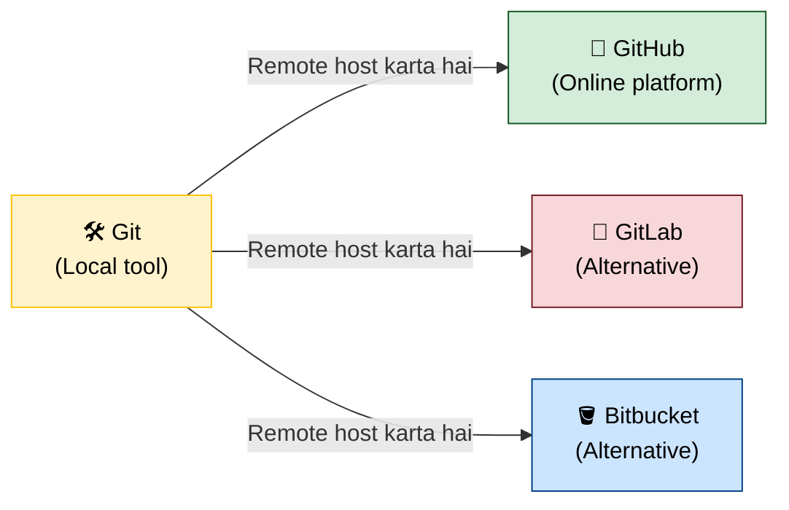
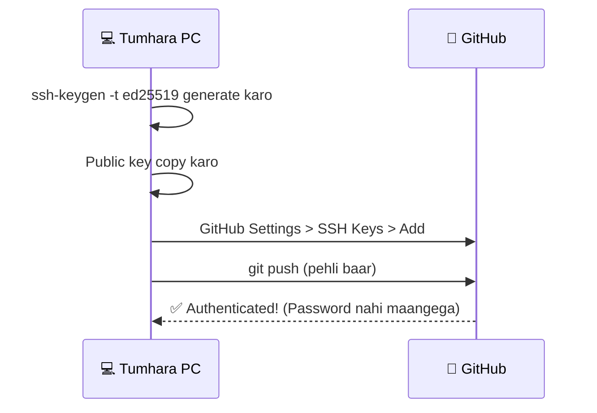
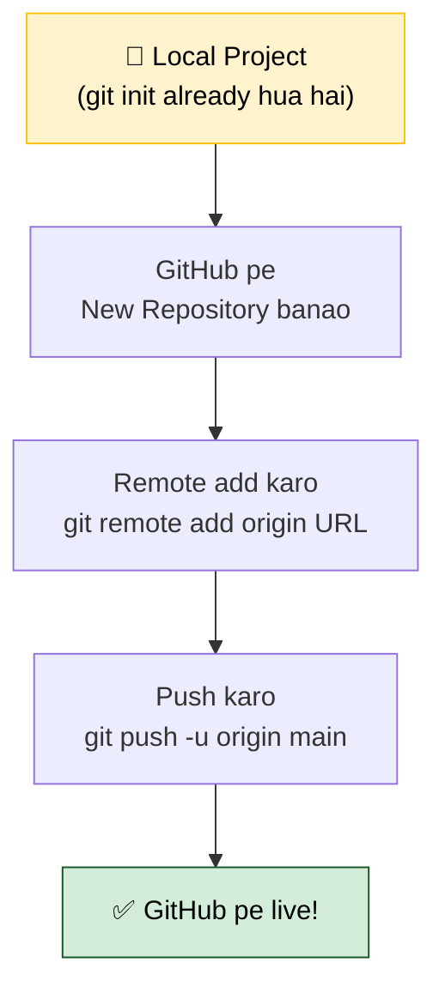
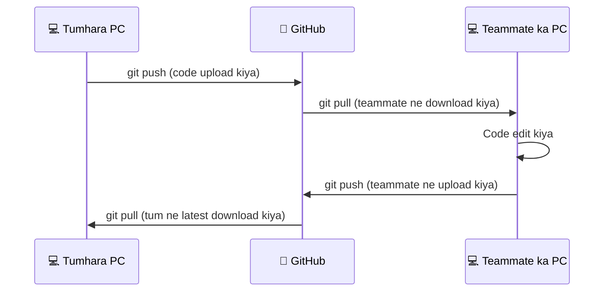
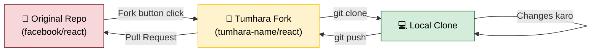
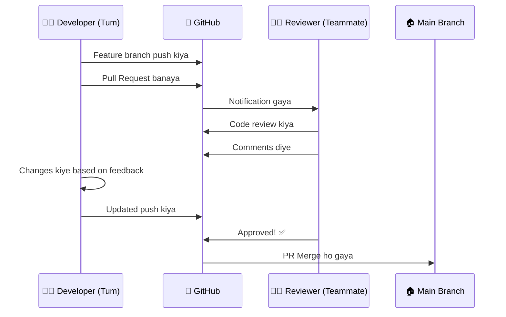
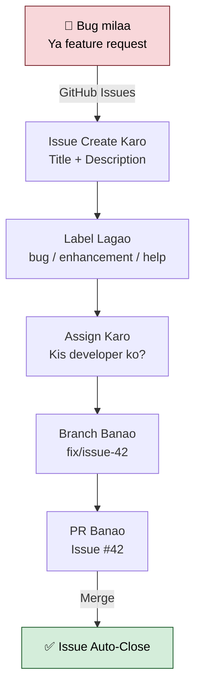
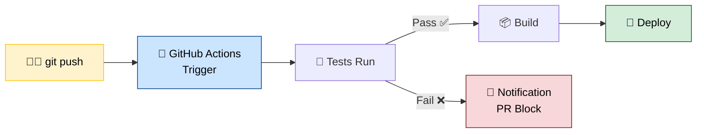
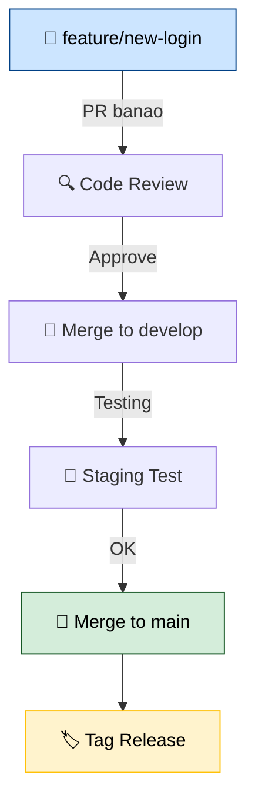
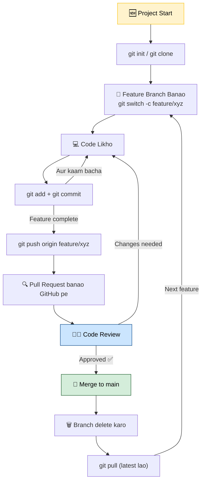

# 🐙 Part 3: GitHub & Team Collaboration — Real World Git!

> **GitHub = Git + Cloud + Team Features** — yahan pe duniya bhar ke developers milte hain!

---

## 🤔 GitHub Kya Hai?



**Git** ek tool hai (software).  
**GitHub** ek website hai jahan tum Git repositories host karte ho.

GitHub pe milta hai:
- ☁️ Free cloud hosting for code
- 👥 Team collaboration tools
- 🔍 Pull Requests (Code Review)
- 🐛 Issue Tracking
- ⚡ GitHub Actions (CI/CD)
- 🌐 GitHub Pages (Free hosting)

---

## 🔑 Authentication Setup

### SSH Key Setup (Recommended — password bar bar nahi maangega)



```bash
# SSH Key generate karo
ssh-keygen -t ed25519 -C "tumhara@email.com"
# Enter dabao (default location theek hai)

# Public key copy karo
cat ~/.ssh/id_ed25519.pub
# Yeh output GitHub pe daalo:
# GitHub > Settings > SSH and GPG keys > New SSH key

# Test karo
ssh -T git@github.com
# Output: Hi username! You've successfully authenticated
```

---

## 🚀 GitHub Pe Project Upload Karna



```bash
# Step 1: GitHub pe New Repository banao (website pe jaake)
# Repository name do, public/private select karo

# Step 2: Remote connect karo
git remote add origin git@github.com:tumhara-username/repo-name.git

# Verify karo
git remote -v
# Output:
# origin  git@github.com:username/repo-name.git (fetch)
# origin  git@github.com:username/repo-name.git (push)

# Step 3: Push karo
git push -u origin main
# -u flag pehli baar use karo — upstream set karta hai
# Baad mein sirf: git push
```

---

## 📥 Clone — Kisi Ka Bhi Project Download Karo

```bash
# HTTPS se clone (simple)
git clone https://github.com/user/repo.git

# SSH se clone (recommended)
git clone git@github.com:user/repo.git

# Specific folder mein clone karo
git clone git@github.com:user/repo.git mera-folder

# Clone ke baad
cd repo
git status
```

---

## 🔄 Push & Pull — Sync Karte Raho



```bash
# Code push karo (local → GitHub)
git push

# Latest code pull karo (GitHub → local)
git pull

# Sirf fetch karo, merge mat karo (safe!)
git fetch origin

# Fetch + Merge (pull = fetch + merge)
git pull origin main

# Force push (DANGEROUS — team project mein mat karo!)
git push --force
```

---

## 🍴 Fork — Doosre Ka Project Apna Banao



```bash
# Fork ke baad workflow:

# 1. Fork GitHub pe button se (website pe)

# 2. Apna fork clone karo
git clone git@github.com:TUMHARA-USERNAME/react.git

# 3. Original repo ko upstream add karo
git remote add upstream git@github.com:facebook/react.git

# 4. Latest changes sync karo original se
git fetch upstream
git merge upstream/main

# 5. Feature branch pe kaam karo
git switch -c fix/button-bug

# 6. Push karo apne fork pe
git push origin fix/button-bug

# 7. GitHub pe Pull Request banao (website pe)
```

---

## 🔍 Pull Request (PR) — Code Review Ka Process



### PR Banana Ka Process:
```
1. Feature branch pe kaam karo
2. Push karo: git push origin feature/my-feature
3. GitHub pe jaao → "Compare & Pull Request" button
4. Title aur description likho (kya kiya, kyun kiya)
5. Reviewers assign karo
6. Submit!
```

### Good PR Description Template:
```markdown
## Kya Kiya?
Login page banaya with validation

## Kyun?
Users ko secure login chahiye tha

## Screenshots
[UI ka screenshot]

## Test Kaise Karein?
1. /login pe jaao
2. Empty fields ke saath submit karo
3. Error message dikhega
```

---

## 🐛 Issues — Bug Track Karo



```bash
# Commit message mein issue close karo:
git commit -m "Fix login bug - closes #42"
# PR merge hone pe Issue #42 auto-close ho jayega!
```

---

## ⚡ GitHub Actions — Automation (CI/CD)



```yaml
# .github/workflows/ci.yml

name: CI Pipeline

on:
  push:
    branches: [main, develop]
  pull_request:
    branches: [main]

jobs:
  test:
    runs-on: ubuntu-latest
    steps:
      - uses: actions/checkout@v3
      
      - name: Node.js Setup
        uses: actions/setup-node@v3
        with:
          node-version: '18'
      
      - name: Dependencies install karo
        run: npm install
      
      - name: Tests run karo
        run: npm test
      
      - name: Build karo
        run: npm run build
```

---

## 🌐 GitHub Pages — Free Website Host Karo!

```bash
# Option 1: Docs folder se (recommended)
# GitHub Settings > Pages > Source: /docs folder

# Option 2: gh-pages branch se
npm install -g gh-pages

# package.json mein add karo:
# "homepage": "https://username.github.io/repo-name"
# "deploy": "gh-pages -d build"

npm run build
npm run deploy

# Tumhara site live ho gaya:
# https://tumhara-username.github.io/repo-name
```

---

## 🤝 Team Collaboration Best Practices



### Team Rules (Follow Karo!):

| Rule | Kya Karna Hai |
|------|--------------|
| **Never push to main directly** | Hamesha PR se |
| **Ek PR mein ek kaam** | Focus raho |
| **Meaningful commit messages** | "fix" mat likho, "Fix login validation" likho |
| **PR description likho** | Reviewer ko samjhao |
| **Pull before push** | `git pull` pehle, toh `git push` |
| **Review dena** | Doosron ka bhi review karo |

---

## 🔧 Advanced GitHub Features

### Protected Branches:
```
GitHub > Repo Settings > Branches > Add Rule
✅ Require pull request reviews before merging
✅ Require status checks to pass
✅ Restrict who can push to matching branches
```

### Stash — Kaam Aadha Chhod ke Emergency Fix:
```bash
# Situation: Feature bana rahe the, suddenly urgent bug fix aana hai

# Current unfinished work save karo
git stash
git stash save "Login form half done"

# Emergency fix karo
git switch main
git switch -c hotfix/urgent-bug
# ... fix karo ...
git commit -m "Urgent bug fix"
git switch main
git merge hotfix/urgent-bug

# Apne kaam pe wapas jaao
git switch feature/login
git stash pop           # Last stash wapas lao
git stash list          # Sab stashes dekho
git stash apply stash@{0}  # Specific stash
```

### Cherry-Pick — Sirf Ek Commit Chahiye:
```bash
# Situation: Doosri branch ka sirf ek commit chahiye

# Commit hash dekho
git log --oneline feature/payment

# Sirf woh commit apni branch pe lao
git cherry-pick abc1234
```

---

## 📊 Complete Git + GitHub Workflow



---

## 🎯 Final Cheatsheet

```bash
# === SETUP ===
git config --global user.name "Naam"
git config --global user.email "email"

# === DAILY WORKFLOW ===
git pull                          # Pehle latest lo
git switch -c feature/xyz         # Branch banao
# ... code likho ...
git add .                         # Stage karo
git commit -m "Kya kiya"          # Commit karo
git push origin feature/xyz       # Push karo
# GitHub pe PR banao

# === SYNC ===
git fetch origin                  # Check karo kya changes hain
git pull origin main              # Latest lo
git merge main                    # Apni branch mein latest merge karo

# === UNDO ===
git restore filename              # File changes undo
git restore --staged filename     # Unstage
git reset --soft HEAD~1           # Last commit undo (changes rakhna)
git reset --hard HEAD~1           # Last commit undo (changes bhi delete)

# === INFO ===
git status                        # Current state
git log --oneline --graph --all   # Poori history with branches
git diff                          # Changes dekho
git blame filename                # Kisne kya likha
```

---

## 🏆 Congratulations! Tutorial Complete!

Tumne seekha:

**Part 1 — Git Basics:**
- Git kya hai, install aur setup
- Working Directory → Staging → Commit flow
- Basic commands aur undo tricks

**Part 2 — Branching:**
- Branch banana aur merge karna
- Conflict resolve karna
- Rebase aur Git Flow strategy

**Part 3 — GitHub:**
- SSH setup aur authentication
- Push, Pull, Clone, Fork
- Pull Requests aur Code Review
- GitHub Actions (CI/CD)
- Team collaboration best practices

### 🚀 Aage Kya Karein?
1. GitHub pe ek project banao aur push karo
2. Kisi open source project ko fork karo
3. GitHub Actions mein ek simple CI pipeline setup karo
4. GitHub Pages pe apna portfolio deploy karo

**Ab tum Git + GitHub ke liye ready ho!** 💪